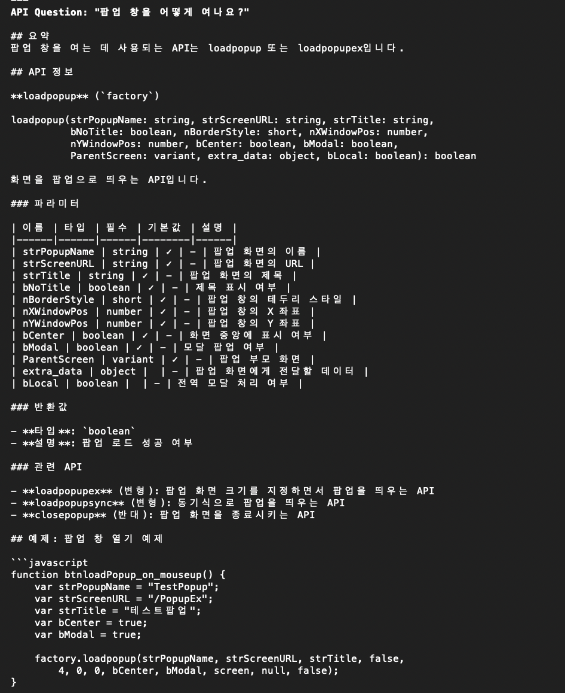

이제 아래 형식으로 나오게 변경했습니다. 스키마 관련 질문과 API 관련 질문을 구분해서 답변 형식을 프롬프트로 정의해 주는 방식입니다.

API 관련 질문: "데이터셋에 행을 어떻게 추가하나요?"  
답변:

## 요약

데이터셋에 한 개의 빈 레코드(행)를 추가하려면 addrow API를 사용합니다.

## API 정보

**addrow** (XDataSet)

addrow(bFireEvent: boolean): number

데이터셋에 한 개의 빈 레코드(행)를 추가합니다.

### 파라미터

### 반환값

- **타입**: number
    
- **설명**: 추가된 행의 인덱스(Zero-Based). 실패 시 -1 반환
    

### 관련 API

- **deleterow** (반대): 데이터셋에서 행을 삭제합니다.
    
- **insertrow** (변형): 특정 위치에 행을 삽입합니다.
    

## 예제: 데이터셋에 행 추가 예제

버튼 클릭 시 데이터셋에 새 행을 추가하고 결과를 확인하는 예제입니다.

JavaScript

function btn_add_on_mouseup(objInst) { var nRow = ds_member.addrow(); if (nRow >= 0) { ds_member.setitemtext(nRow, "STATUS", "N"); factory.consoleprint("추가된 행 인덱스: " + nRow); } else { screen.alert("행 추가에 실패했습니다."); } }

베스트 프랙티스

- 대량 데이터 처리 시 bFireEvent를 false로 설정하고 마지막에 fireevent() 호출
    
- addrow() 반환값 체크로 실패 케이스 처리
    

관련 주제

- 데이터셋 조작
    
- 행 삽입
    
- 이벤트 처리
    

스키마 관련 질문: "그리드 컴포넌트의 XML 구조가 어떻게 되나요?"  
답변:

## 요약

그리드 컴포넌트의 기본 XML 구조를 설명합니다.

컴포넌트 정보

Grid (그리드)

데이터를 테이블 형태로 표시하는 컴포넌트입니다.

부모 요소: panel, screen

자식 요소: column

필수 속성

┌───────────┬────────────────────────┐

│ 속성 │ 설명 │

├───────────┼────────────────────────┤

│ id │ 컴포넌트 고유 ID │

├───────────┼────────────────────────┤

│ name │ 컴포넌트 이름 │

├───────────┼────────────────────────┤

│ link_data │ 바인딩할 데이터셋 ID │

├───────────┼────────────────────────┤

│ version │ 그리드 버전 (1.1 권장) │

└───────────┴────────────────────────┘

선택 속성

┌─────────────────┬─────────┬─────────────────────────┐

│ 속성 │ 타입 │ 설명 │

├─────────────────┼─────────┼─────────────────────────┤

│ x │ number │ X 좌표 │

├─────────────────┼─────────┼─────────────────────────┤

│ y │ number │ Y 좌표 │

├─────────────────┼─────────┼─────────────────────────┤

│ width │ number │ 너비 │

├─────────────────┼─────────┼─────────────────────────┤

│ height │ number │ 높이 │

├─────────────────┼─────────┼─────────────────────────┤

│ linenumber_show │ boolean │ 행 번호 표시 여부 │

├─────────────────┼─────────┼─────────────────────────┤

│ use_checkrow │ boolean │ 체크박스 컬럼 사용 여부 │

└─────────────────┴─────────┴─────────────────────────┘

그리드 기본 구조

데이터셋과 연결된 그리드의 기본 XML 구조입니다.

XML

<panel name="pnl_grid" x="10" y="100" width="1004" height="500"> <grid name="grid_member" x="0" y="0" width="1004" height="480" link_data="ds_member" version="1.1" linenumber_show="1" use_checkrow="1"> <column> <header title="ID" back_color="00F8F9FA"/> <data name="MEMBER_ID" link_data="ds_member:MEMBER_ID" width="80" editable="0"/> </column> <column> <header title="이름" back_color="00F8F9FA"/> <data name="MEMBER_NAME" link_data="ds_member:MEMBER_NAME" width="150" editable="0"/> </column> </grid> </panel>

관련 API

- getselectrow: 선택된 행 인덱스 반환
    
- getitemtext: 셀 값 조회
    
- setitemtext: 셀 값 설정
    

사용 시 주의사항

- Grid는 반드시 panel 내부에 배치해야 합니다
    
- link_data로 연결된 데이터셋의 컬럼과 grid column의 data name이 일치해야 합니다
    
- version="1.1"은 최신 기능 지원을 위해 권장됩니다
    

관련 주제

- 데이터셋 정의
    
- 이벤트 핸들러
    
- 컬럼 속성