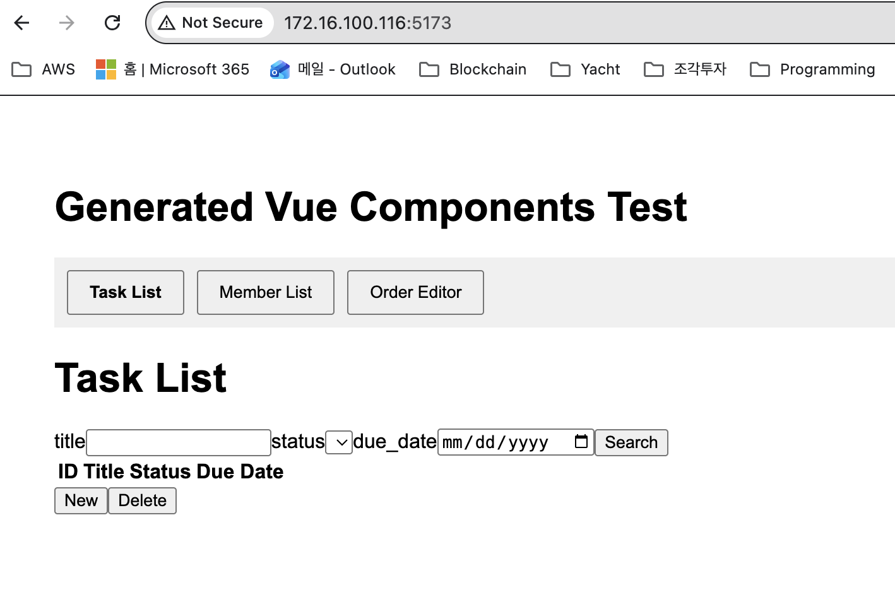

# 2026-02-07: 2월 1주차 진행 (01/26 ~ 02/07)

이 문서는 2026년 1월 26일 ~ 2월 7일 기간 동안의 개발 진행 사항을 종합 정리합니다.

> **이전 진행**: [2026-01-24 1월 4주차 진행](../2026-01-24_progress/) - MCP 아키텍처 변경([architecture_mcp.md](../2026-01-24_progress/architecture_mcp.md)), QA 업데이트([qa_update/](../2026-01-24_progress/qa_update/))

---

## 주요 성과 요약

- MCP 서버 기반 아키텍처 전환 완료
- Vue3, xFrame5 코드 생성 및 프리뷰 기능 구현
- UASL/SUIS v1.1 스펙 확정 → [uasl_spec/](./uasl_spec/)
- 제품명 Coder → **Coco** (Coordinated Coding) 변경
- QA 환각 문제 해결 및 답변 검증 강화
- CGF-A vs CGF-B 전략 벤치마크 완료 → [reports/](./reports/)

---

## 포함 문서

| 문서/폴더 | 설명 |
|----------|------|
| `uasl_spec/` | UASL/SUIS 스펙 문서 (프레임워크 중립 UI 기술 언어) |
| `reports/` | CGF 비교 보고서, QA 기능 개선 보고서 (PDF→MD 변환) |

---

## 아키텍처 변경 (MCP 전환)

*2026-01-27*

1. 지난주부터 착수한 MCP 서버 방식으로 전환 구현 완료
2. Vue 프레임워크 지원 추가

구현된 MCP 서버:
1. **xframe5-compiler**: xframe5 코드(.xml + .js) 생성
2. **vue-compiler**: vue 코드(.vue) 생성

Vue 프레임워크는 xframe5의 경우 생성된 코드가 정상 작동하는지 확인할 수 없어서 특성상 가장 유사한 vue를 선택하여 코드 생성의 정확성 검증. 아래 첨부 화면은 실제 생성된 뷰 화면.

---

## 코드 생성 및 QA 기능 개선

*2026-01-28*

### 코드 생성 개선 사항

1. **MCP 이용한 새로운 파이프라인 추가**
   - 기존 파이프라인: 의도 파악 및 코드 생성 과정 LLM / post-processing은 프로그램으로 처리
   - 새 파이프라인: 의도 파악 및 스펙(추가 기능) 생성만 LLM / 코드생성은 프로그램으로 처리
   - 각 타겟 프레임워크(xframe5, spring, python, vue 등) 별 MCP 서버가 코드 생성 및 검증 → 전체 코드 리빌드 없이 MCP 서버만 추가하므로 확장성 좋음
2. **대대적인 리팩토링 진행 중**
   - 새로운 파이프라인 추가에 따라 사용 복잡도 증가 및 유지보수 난이도 증가 → 통합 파이프라인

### QA 기능 개선 사항

1. 환각 문제 해결
2. 동일한 스코어의 복수 후보 답변에 대한 사용자 선택

### 관련 보고서

- [CGF 비교 보고서](./reports/cgf_comparison_20260128.md) - CGF-A(Direct) vs CGF-B(Spec-first+MCP) 전략 벤치마크. 4개 테스트에서 CGF-B가 3:1 우위, 65% 속도 개선
- [QA 기능 개선 보고서](./reports/qa_improvement_20260128.md) - QA 환각 문제 해결. 핵심 원칙: "추론 말고 추출", "모호함은 사용자에게 확인"

---

## Coco 제품 정의

*2026-02-02*

웹 기반의 사용자 애플리케이션을 추가했습니다.
아울러 제품명을 기존 임시로 사용하던 Coder에서 Coco로 변경하여 코드에 모두 반영하였습니다.

**Coco (Coordinated Coding) 제품 구성**:
- **Coco Engine** (서버)
- **Coco Admin** (설정 및 사용자 관리)
- **Coco CLI** (유닉스/리눅스/윈도우 커맨드 프롬프트 실행)
- **Coco Studio** (질의응답/코드생성/코드리뷰)
- **MCP Servers**: 현재 xframe5-compiler, xframe5-validator, vue-compiler 등 4개 구현. 계속 확장 가능
- **Eclipse Plugin**

**데모 영상**:
- <video controls src="../../_00_work/260127-260211/0202_coco studio.mov" title="Coco Studio"></video>
- <video controls src="../../_00_work/260127-260211/0202_coco studio result.mov" title="Coco Studio 결과"></video>

---

## QA 오류 조치

*2026-02-03*

소프트베이스 홍상무 회의 시간에 QA 답변 오류 사항에 대해 원인 찾아내 해결.

대량 데이터를 임포트하는 작업하면서 category 컬럼에 잘못된 값이 들어가 있었음.
결과적으로 API 내용에 대한 의미 검색이 이루어지지 못하여 답변 오류 및 내용이 부실한 현상을 보임.
조치 후 답변에 대해 홍상무 OK 확인.

---

## UASL 스펙 문서

*2026-01-29 ~ 2026-02-04*

UASL(Universal Application Specification Language) 관련 스펙 문서. 자세한 내용은 [uasl_spec/](./uasl_spec/) 참조.

- 2026-01-29: 초기 SUIS 스펙 공유 (한/영)
- 2026-02-04: 보완 업데이트 배포

---

## xFrame5 실행 환경

*2026-02-04*

소프트베이스 xFrame5 실행 환경 파일.

설치 방법:
- 압축 해제 후 README.txt 파일 참고
- [`xframe5_runenv_20260204_1.zip`](../../_00_work/260127-260211/0204_xframe5_runenv_20260204_1.zip)

---

## xFrame5 Preview 기능 구현

*2026-02-05*

소프트베이스에서 받은 런타임을 Studio 웹서버에 탑재.
생성된 코드창에서 프리뷰 버튼 클릭시 별도 창에서 화면 미리보기 실행.
- 오류는 백엔드 연결이 안 되어 나오는 것이므로 무시
- Mockup data 생성하여 보여주는 기능 구현 중

**1. 구현 중**
- <video controls src="../../_00_work/260127-260211/0205_coco-xframe5-codegen.mov" title="coco-xframe5-codegen"></video>

**2. 오류 수정**
- <video controls src="../../_00_work/260127-260211/0205_codegen-detailview.mov" title="codegen-detailview"></video>
- <video controls src="../../_00_work/260127-260211/0205_codegen-listview.mov" title="codegen-listview"></video>

**3. Mockup 데이터를 이용해 실제 검색 버튼 실행하는 예시**
- <video controls src="../../_00_work/260127-260211/0205_codege-listview-with-data.mov" title="codege-listview-with-data"></video>

---

## Vue3 Preview 기능 구현

*2026-01-26*

xFrame5에 이어 Vue3에 대한 미리보기 기능도 구현했습니다.
스펙 생성까지는 동일하며 프로젝트 설정이 Vue, xFrame5 중 어느 것인지에 따라 다른 코드가 생성되며
생성된 코드에 대한 미리보기를 지원합니다.

- <video controls src="../../_00_work/260127-260211/0206_codegen-vue.mov" title="codegen-vue"></video>

---

## 데모 서버 안내

*2026-02-07*

~~http://172.16.100.116:5173~~ (deprecated - 전에 썼던 https 접속 안내는 무시하시기 바랍니다. http로 접속할 수 있게 변경했습니다.)

현재는 도메인 부여하여, 시선AI 내부망에서 URL로 접근이 가능합니다.

https://coco.secernai.net

---

## 데모 영상 / 스크린샷 목록

아래 파일들은 `_00_work/260127-260211/`에 원본이 보관되어 있습니다.

| 파일 | 설명 |
|------|------|
| [`0202_coco studio.mov`](../../_00_work/260127-260211/0202_coco%20studio.mov) | Coco Studio 데모 |
| [`0202_coco studio result.mov`](../../_00_work/260127-260211/0202_coco%20studio%20result.mov) | Coco Studio 결과 화면 |
| [`0205_coco-xframe5-codegen.mov`](../../_00_work/260127-260211/0205_coco-xframe5-codegen.mov) | xFrame5 코드생성 |
| [`0205_codegen-detailview.mov`](../../_00_work/260127-260211/0205_codegen-detailview.mov) | 상세뷰 코드생성 |
| [`0205_codegen-listview.mov`](../../_00_work/260127-260211/0205_codegen-listview.mov) | 리스트뷰 코드생성 |
| [`0205_codege-listview-with-data.mov`](../../_00_work/260127-260211/0205_codege-listview-with-data.mov) | 리스트뷰 + Mockup 데이터 |
| [`0205_codegen-vue.mov`](../../_00_work/260127-260211/0205_codegen-vue.mov) | Vue 코드생성 |
| [`0206_codegen-vue.mov`](../../_00_work/260127-260211/0206_codegen-vue.mov) | Vue 코드생성 (업데이트) |
| [`0127_중요업데이트_image.png`](../../_00_work/260127-260211/0127_중요업데이트_image.png) | MCP 전환 후 생성 화면 |
| [`0203_HandOff.png`](../../_00_work/260127-260211/0203_HandOff.png) | HandOff 화면 |
| [`0203_Screenshot 2026-02-03 at 7.41.38 PM.png`](../../_00_work/260127-260211/0203_Screenshot%202026-02-03%20at%207.41.38%20PM.png) | QA 오류 조치 스크린샷 |

---

## 원본 파일 전체 목록

`_00_work/260127-260211/` 내 모든 파일에 대한 처리 현황입니다.

| 원본 파일 | 처리 방식 |
|---------|---------|
| `0126_Vue3 Preview 기능 구현.md` | 이 README에 인라인 |
| `0127_중요업데이트.md` | 이 README에 인라인 |
| `0127_중요업데이트_image.png` | 이 README에서 이미지 참조 |
| `0128_CGF_비교_보고서_20260128.pdf` | → `reports/cgf_comparison_20260128.md` (MD 변환 후 삭제) |
| `0128_QA_기능_개선_보고서.pdf` | → `reports/qa_improvement_20260128.md` (MD 변환 후 삭제) |
| `0128_코드 생성 및 QA 기능 개선 업데이트.md` | 이 README에 인라인 |
| `0129_04-suis-spec_en.md` | → `uasl_spec/suis_spec_en.md` (복사) |
| `0129_04-suis-spec_kr.md` | → `uasl_spec/suis_spec_kr.md` (복사) |
| `0129_UASL 스펙 문서 공유.md` | `uasl_spec/README.md`에 인라인 |
| `0129_UASL-dist.zip` | `uasl_spec/README.md`에서 참조 |
| `0129_UASL-specs.zip` | `uasl_spec/README.md`에서 참조 |
| `0129_suis_prompts.yaml` | → `uasl_spec/suis_prompts.yaml` (복사) |
| `0202_coco studio result.mov` | 이 README에서 영상 참조 |
| `0202_coco studio.mov` | 이 README에서 영상 참조 |
| `0202_주요 업데이트-사용자 애플리케이션 개발.md` | 이 README에 인라인 |
| `0203_HandOff.png` | 이 README에서 이미지 참조 |
| `0203_Screenshot 2026-02-03 at 7.41.38 PM.png` | 이 README에서 이미지 참조 |
| `0203_xFrame5 QA 답변 오류 조치 완료.md` | 이 README에 인라인 |
| `0204_UASL 스펙 업데이트.md` | `uasl_spec/README.md`에 인라인 |
| `0204_dist.zip` | `uasl_spec/README.md`에서 참조 |
| `0204_xframe5_runenv_20260204_1.zip` | 이 README에서 참조 |
| `0204_소프트베이스 xFrame5 실행 환경 파일.md` | 이 README에 인라인 |
| `0205_coco-xframe5-codegen.mov` | 이 README에서 영상 참조 |
| `0205_codege-listview-with-data.mov` | 이 README에서 영상 참조 |
| `0205_codegen-detailview.mov` | 이 README에서 영상 참조 |
| `0205_codegen-listview.mov` | 이 README에서 영상 참조 |
| `0205_codegen-vue.mov` | 이 README에서 영상 참조 |
| `0205_xFrame5 preview 기능 구현.md` | 이 README에 인라인 |
| `0206_codegen-vue.mov` | 이 README에서 영상 참조 |
| `0207_116 서버 이용한 데모.md` | 이 README에 인라인 |
